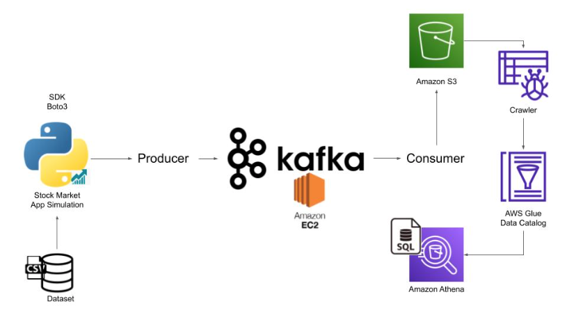

# Weather Kafka Real Time Data Engineering Project

## Introduction 
In this project, I will be executing an End-To-End Data Engineering Project on Real-Time Weather Data using Kafka.

I am going to use different technologies such as Python, Amazon Web Services (AWS), Apache Kafka, Glue, Athena, and SQL.

## Architecture 

## Technology Used
- Programming Language - Python
- Amazon Web Service (AWS)
1. S3 (Simple Storage Service)
2. Athena
3. Glue Crawler
4. Glue Catalog
5. EC2
- Apache Kafka

## Dataset Used
I decided to use Weather API, but I was mainly interested in operation side for this project(building data pipeline).

